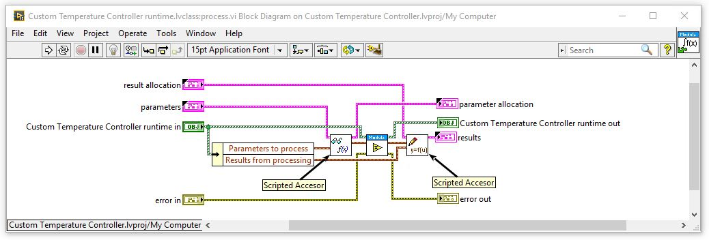
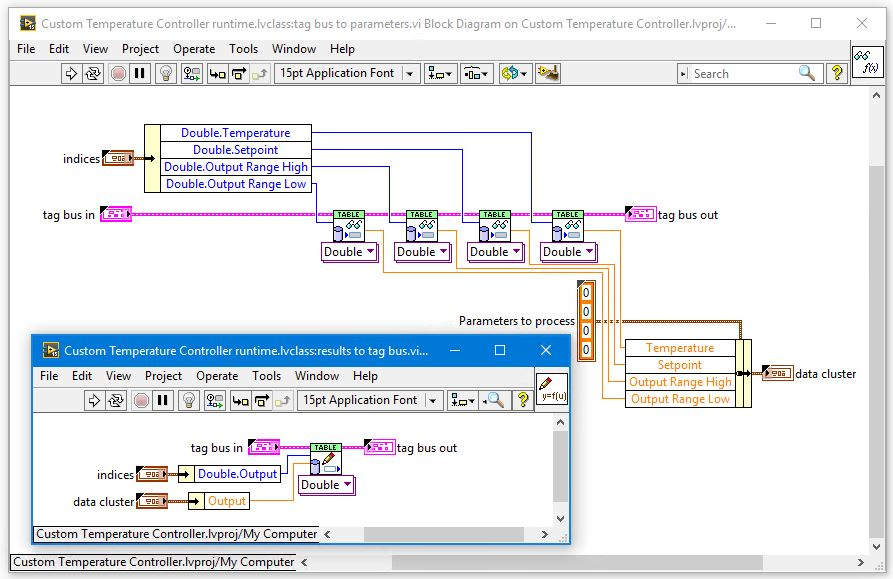
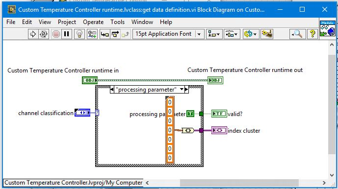
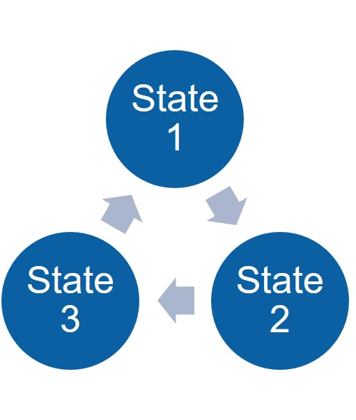

# Hands-On 2: Static Modules
This hands-on covers the creating of a DCAF Static module, this modules are easier to create and the recommended option if the module developer knows the number of channels that the module will require.
It is recommended that the Hands-On 1 is completed before doing this one.

<!-- TOC depthFrom:1 depthTo:6 withLinks:1 updateOnSave:1 orderedList:0 -->

- [Hands-On 2: Static Modules](#hands-on-2-static-modules)
	- [Introduction:](#introduction)
	- [Exercise 1:](#exercise-1)
			- [Concepts Covered:](#concepts-covered)
			- [Module Definition:](#module-definition)
		- [Part A: Create a Static PID Module](#part-a-create-a-static-pid-module)
				- [Create module from template](#create-module-from-template)
		- [Part B: Update the Static PID Module with scripting](#part-b-update-the-static-pid-module-with-scripting)
				- [Update the clusters](#update-the-clusters)
				- [Run the scripting](#run-the-scripting)
		- [Part C: Implement the user process](#part-c-implement-the-user-process)
		- [Part C: Running and Configuring the Module](#part-c-running-and-configuring-the-module)
				- [Configuration Editor](#configuration-editor)
				- [Running the Code](#running-the-code)
	- [Exercise 2:](#exercise-2)
			- [Concepts Covered:](#concepts-covered)
			- [Module Definition:](#module-definition)
		- [Part A: Create the state machine module](#part-a-create-the-state-machine-module)
		- [Part B: Create a DCAF Application that runs the Static Module](#part-b-create-a-dcaf-application-that-runs-the-static-module)

<!-- /TOC -->

## Introduction:

DCAF Static modules are simple custom modules that are easy to create with the restriction that the module developer needs to know the number of channels that the module will have. By having the known number of channels, DCAF contain useful scripting tools that simplifies the module development.

Before creating a DCAF Static module there is an important checklist to cover:

- Is there a module that already covers this functionality?
- Is this a static or a dynamic module?
- What inputs or outputs my module needs?

In each exercise will go through this checklist during the module definition, and a more on how to define DCAF modules can be found in the DCAF developer guide in section 4.

## Exercise 1:
In this exercise we will create a DCAF Static module that contains a custom PID control for our application.

#### Concepts Covered:
- Static Module Creation
- Basic Static Module overrides
- Static channel Configuration
- Working with the User Process VI
- Static Module Scripting

#### Module Definition:
This is processing module that will contain a single PID. Initially it will have some values hardcoded and will be updated to change so they can be updated by the engine.
- Is there a module that already covers this functionality?
In this case yes there is a PID module for DCAF that could be used, but as we want to go with the exercise we are going to ignore it.
-Is this a static or dynamic modules?
The module only needs 1 pid, and we know the inputs required for the PID so it is a static module.
-What inputs or outputs my module needs?
This is a processing module all its inputs come from the Tag Bus and all the outputs go into the Tag Bus. The initial channel list is the following one:

Name               | 	Type   |  Direction
--                 |  ---    |--
Temperature        | Double  |  Processing Parameter
Setpoint           | Double  |  Processing Parameter
Output Range High  | Double  |  Processing Parameter
Output Range Low   | Double  |  Processing Parameter
Output             | Double  |  Processing Result

This channel list will change during the exercise.

### Part A: Create a Static PID Module
##### Create module from template
1. Navigate to **Project >> Create Project…**
2. In the tree on the left, select **DCAF >> Modules** and select **DCAF Static Channel Module**.
3. Type **Custom Temperature Controller** as the **Module Name**.
4. Look for the Project Root **\\Temperature Controller\Modules** and create a folder called **Custom Temperature Controller**. Get into that folder and press **Current Folder**.
6. Add the following parameters to your new module as **Channels** in the **Channel Specifications** tab. Channels represent data passed to or from your module during different execution stages, and channel names are case sensitive. The direction specifies whether the data is to the module or from the module, and is divided into inputs (data provided by input.vi), outputs (data provided to output.vi), and processing parameters and results (data passed to and from process.vi). For this hands on we will implement a processing step.

Name               | 	Type   |  Direction
--                 |  ---    |--
Temperature        | Double  |  Processing Parameter
Setpoint           | Double  |  Processing Parameter
Output Range High  | Double  |  Processing Parameter
Output Range Low   | Double  |  Processing Parameter
Output             | Double  |  Processing Result

Your configuration should look like the one shown in Figure 1.1.

|
|:--:|
|*Figure 1.1*

7.	Press Finish.

||
|:--:|
|*Figure 1.2*|

8. Your new project will appear. Navigate to **Custom Controller Module runtime.lvclass** and open **user process.vi**. This method should have two clusters, one input and one output, which match the list of tags above. This clusters were created based on the table you just filled in.

||
|:--:|
|*Figure 1.3*|

9.	Open process.vi in the overrides folder.

|
|:--:|
|*Figure 1.4*

On either side, Scripted Accessors convert tag bus data into your user-defined cluster. These methods are not automatically generated by the project scripting tool and must be generated when the project is first scripted or after any change to the interface. we will cover how to make changes to this VIs in Part B of this exercise. This accessors will look like figure 1.5.

|
|:--:|
|*Figure 1.5*

### Part B: Update the Static PID Module with scripting
As with any project requirment changed and we need to add channels for the  P,I,D values. In this section we are going to update our module channel list matches this table:

Name               | 	Type   |  Direction
--                 |  ---    |--
Temperature        | Double  |  Processing Parameter
Setpoint           | Double  |  Processing Parameter
Output Range High  | Double  |  Processing Parameter
Output Range Low   | Double  |  Processing Parameter
P                  | Double  |  Processing Parameter
I                  | Double  |  Processing Parameter
D                  | Double  |  Processing Parameter
Output             | Double  |  Processing Result

##### Update the clusters
10. Open the **parameter user data.ctl**

|
|:--:|
|*Figure 1.6*

11. Add the new channels for the cluster to look like in figure 1.7

|
|:--:|
|*Figure 1.7*

12. Save the control and apply changes **File>>Apply Changes**

**Note**: If you are adding channels of a different type that the module previously didn't have like a input channel in this case. It is necessary to modify  **get data definition.vi** in the runtime class. The “valid?” Boolean for each case of the case structure indicates whether or not the data interface is valid and if that method should be run. Setting a given Boolean to true tells the framework that you’d like to configure and run that method. If you followed the steps above, the Boolean should be true for processing parameters and processing results. The script will use these Booleans to determine if a given cluster is valid (the “placeholder” fields are just there to ensure the clusters are not broken).

|
|:--:|
|*Figure 1.8*

##### Run the scripting
**Note**: During this process, the lvclass files are modified and so LabVIEW requires that your classes are not loaded in multiple contexts. That is, you must close any other projects which currently have the class loaded. If you see a “lock” icon over the class, the script will not work.
13.	Open **Tools >> DCAF >> Launch Control Module Scripting Utility…**
14.	Drag the runtime class from the project over the runtime class path control or browse for it manually, then repeat for the configuration class (YourModuleName Configuration.lvclass).
Because you used the script, you can leave most options as the default and press Run. and it should look like Figure 1.9

|
|:--:|
|*Figure 1.9*

15. Save all the VIs

### Part C: Implement the user process

16. Navigate to **Custom Controller Module runtime.lvclass**, open **user process.vi** and implement the same PID control as shown in the Figure 1.9

|
|:--:|
|*Figure 1.10*

  1. Drop down an instance of **PID.vi** from **Control and Simulation >> PID >> PID.vi.**
  2. Drop down the following functions: 1 Unbundle by Name, 2  Bundle by Name function.
  3. Wire the Unbundle by Name function to the Parameters to process cluster. Expand all the terminals.
  4. Wire **Parameters to process.Temperature** to **PID.vi process variable input**.
  5. Wire Parameters to **process.setpoint** to **PID.vi setpoint input**.
  6. Create a constant from **Results from PID.vi output range input**. and wire it to **Bundle by Name**.
  7. Bundle Parameters to **process.output range high** and **Parameters to process.output range low** and wire the cluster to **PID.vi output range input.**
  8. Create a constant from **PID.vi PID gains input**. and wire it to **Bundle by Name**.
  9. Bundle **Parameters to process.P**, **Parameters to process.I**, and P**arameters to process.D** and wire the cluster to **PID.vi PID gains input**.
  10. Create a constant from Results from processing indicator and connect it to the Bundle by Name input cluster terminal. Expand the Unbundle by Name Function to have 2 terminals.
  11. Wire PID.vi output to **Output** from **processing.Output**.
  12. The result should look something like Figure 1.9.

17.	Save the new project and close it.

### Part C: Running and Configuring the Module
##### Configuration Editor
18. Open Standard Configuration Editor (**Open Tools >> DCAF >> Launch Standard Configuration Editor…**).
19.	Navigate to **Tools >> Edit Plugin Search Paths**.
20.	Press Add and navigate to the location of your new control module (**\\Temperature Controller\Modules\**).
**Note**: Add the whole modules directory as the simulation module is in that folder.
21. Open Static **Temperature Controller.pfcg** in the exercise folder.
22.	Now, right click on Standard Engine and select **Add >> Other>>Custom Controller Module**. Then, select this new module from the tree.
23.	For each processing parameter tag, right click on the column Mapped to System Tag and configure the channel to be mapped to the appropriate system tag. You can look at “Temperature Controller Logic” to identify the correct mapping, which looks like Figure 1.11:

|
|:--:|
|*Figure 1.11*

18.	Now, click on the output ranges and press Set Default for each. Set output range high to 100 and output range low to 0 (this is not required, as the default if not set is 0). These are unmapped parameters, meaning they can be modified in the editor but they are constants at runtime – output range high will always be 100.

|
|:--:|
|*Figure 1.12*

19.	Finally, we need to map our results to system tags.
**Note**: If the tag we need already has a writer you have to disconnect it.
20.	Select to File >> Save.
21. From the Temperature Controller Project Window, open Host Module Includes.vi.  This function ensures that all appropriate modules are loaded into memory. You can also load precompiled modules (llb or lvlibp files) from disk, but for our purposes we will simply hardcode the appropriate modules.

|
|:--:|
|*Figure 1.13*

##### Running the Code

24. Open the **Temperature Chamber** Project located in **\\Temperature Controller\**
25. Verify the File path is the same as the one you use to store the configuration.

||
|:--:|
| *Figure 1.13*  |

**Note:** If the configuration file name is not valid you will receive error 538500

26. Run the **Main.VI**

## Exercise 2:
In this exercise we will create a DCAF Static module that contains a state machine. This is a optional and advance exercise so there are no detailed instructions. To create this module you can use exercise 1 as reference and the DCAF developer guide section 4. There is a solution included in the solutions folder.

#### Concepts Covered:
- Use of runtime class private data
- Module initialization
- Static module parameters

#### Module Definition:
The module will be a simple state machine that contains 3 states. This states will transition from one state to the next only if just the correct Boolean is selected.

The state machine will have simple transitions.
- Change from state 1 to state 2 if only A is True
- Change form state 2 to state 3 if only B is True
- Change from state 3 to state 1 if only C is True

||
|:--:|
| *Figure 2.1*  |

The inputs and outputs list for this modules are:

Name               | 	Type   |  Direction
--                 |  ---    |--
A                  | Double  |  Processing Parameter
B                  | Double  |  Processing Parameter
C                  | Double  |  Processing Parameter
State 1            | Double  |  Processing Result
State 2            | Double  |  Processing Result
State 3            | Double  |  Processing Result

In addition to this the module will have a parameter that defines the initial state:
-initial_state: I32

### Part A: Create the state machine module
1. Create module from template
2. Add the state to the runtime
3. Initialize the state
4. Implement the user process
5. Test the user process stand alone

### Part B: Create a DCAF Application that runs the Static Module
1. Create a new project with the Basic Execution Template
2. Create a new vi for the UI that looks like figure 2.2
3. Create a DCAF configuration that maps the state machine to the UI using the UI modules
4. Run the application and test.

||
|:--:|
| *Figure 2.2*  |
