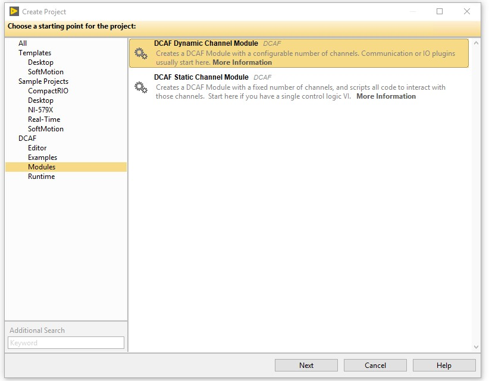

# Hands-On 3: Dynamic Module
This hands-on covers the creating of a DCAF Dynamic module, this modules are advance modules that provide additional flexibility as the number of channels of the module are configured by the final user.
It is recommended that the Hands-On 1 and 2 are completed before doing this one Hands On.

<!-- TOC depthFrom:1 depthTo:6 withLinks:1 updateOnSave:1 orderedList:0 -->

- [Hands-On 3: Dynamic Module](#hands-on-3-dynamic-module)
	- [Exercise 1 Multiplexer Module:](#exercise-1-multiplexer-module)
			- [Concepts Covered:](#concepts-covered)
			- [Module Definition:](#module-definition)
		- [Part A: Dynamic Module Creation and Configuration](#part-a-dynamic-module-creation-and-configuration)
		- [Part B: Dynamic Module Runtime](#part-b-dynamic-module-runtime)
		- [Part C: Dynamic Module Editor Node](#part-c-dynamic-module-editor-node)
		- [Part D:  Create a a DCAF Application that runs the Static Module](#part-d-create-a-a-dcaf-application-that-runs-the-static-module)

<!-- /TOC -->

## Exercise 1 Multiplexer Module:

#### Concepts Covered:
- Dynamic Module Creation
- Dynamic Module Configuration Class overrides
- The use of Lines Cluster and Methods
- Dynamic Module Runtime Class overrides
- Dynamic Module Editor Node Class overrides
- Use of the Table API
- Dynamic Module Unit Testing
- Module Level Configuration parameters

#### Module Definition:
 - This Dynamic Processing module will select between 2 input Double channel  which will be sent as an output based on a Boolean input.
 A single module must support multiple multiplexers
 - Input Channels will be Doubles, output will be Double and the select a Boolean.
 - There is a scaling multiplier that affect all modules, and multiply the output. This is defined in the configuration and has a default value of 1.

### Part A: Dynamic Module Creation and Configuration
1. Create a dynamic module using the DCAF Dynamic Channel Module template.

||
|:--:|
|*Figure 1.1*|

1. Confugre your module to allow multiple instances, allow running on any target and supporting only doubles and booleans as datatypes.
1. Locate and modify **Line.ctl** with channels and settings needed for a given line to operate. In this case we will create separate channels for the inputs ‘A’, ‘B’ and ‘Select’ and the output ‘Output’. 

||
|:--:|
|*Figure 1.2*|
 
1. Override Get Line Name
1. Update Get channels from line
1. Implement to String and from String
1. Update the Create test configuration VI
1. Update the to string and from String Unit test
1. Implement the From String Array to String Array
1. Update the From String Array to String Array Unit test

### Part B: Dynamic Module Runtime
1. Initialize the runtime class with the scaling value
2. Write the runtime to multiplex channels
3. Unit test the runtime.

### Part C: Dynamic Module Editor Node
1. Define Columns
2. Callbacks
3. To Table
4. Line Configuration Dialog.

### Part D:  Create a a DCAF Application that runs the Static Module
Create a new project with the Basic Execution Template
2. Configure the UI
3. Create a DCAF configuration that maps the state machine to the UI using the UI modules
4. Run the application and test.
